# Hugh Greethead - T2A2 

## Aus-Bitcoin-Marketplace: Ruby on Rails two-sided marketplace application

The Aus-Bitcoin-Marketplace is an application that provides a two-sided marketplace for Bitcoin users to find, buy and sell Bitcoin. (But not actually, demonstrative purposes only - as trade/facilitation of Bitcoin is usually subject to strict KYC/AML requirements). 

Live application: https://aus-bitcoin-marketplace.herokuapp.com/

Coder Academy Project Github: https://github.com/HughG-50/rails-marketplace-project

Live updated Github for project deployment: https://github.com/HughG-50/aus-bitcoin-marketplace

## Identify the problem you’re trying to solve by building this marketplace app.

Bitcoin is a decentralized digital currency that exists with a central bank or administrator that can be sent without intermediaries on the peer-to-peer Bitcoin network. Due to its decentralized nature and hard cap supply limit of 21 million, Bitcoin has an attractive use case as an investment/hedge against inflation that is robust and censorship resistant. 

One of the main problems for Bitcoin is acquiring it. The two main ways that Bitcoin can be acquired is either by mining new coins (the inbuilt protocol reward system for network participants that process transactions and secure the network), or by purchasing/acquiring coins that are already in circulation (i.e. have been mined already).

The Aus-Bitcoin-Marketplace is an application that provides a two-sided marketplace for Bitcoin users to find, buy and sell Bitcoin. (But not actually, demonstrative purposes only - as trade/facilitation of Bitcoin is usually subject to strict KYC/AML requirements).

### Why is it a problem that needs solving?

For more smaller, more regional markets outside of the USA such as Australia, the available options for purchasing Bitcoin are largely limited to a few major entities. The majority of these entities operate with a broker model rather than a direct peer-to-peer marketplace. 

Aus-Bitcoin-Marketplace aims to solve this problem by providing a more direct peer-to-peer marketplace, allowing consumers more choice as to where they source their Bitcoin from.

Also by providing competitive peer-to-peer alternatives, this reduces the chance of price gouging behaviour from the incumbents, (particularly in less competitive, more regional global markets) and will naturally drive down the fees and costs for consumers seeking to participate in the Bitcoin market. Overall producing a better outcome for the consumer/Bitcoin investor.

## Description of Aus-Bitcoin-Marketplace app and high-level components (abstractions):

**Purpose:** The purpose of this application is to provide a marketplace for people that wish to buy and/or sell Bitcoin with Australian dollars, to come together and facilitate trade as an alternative to the incumbent businesses in the market.

**Target audience:** The target audience for this application is anyone seeking a means to acquire Bitcoin within Australia. It is catered more towards users who value having alternatives compared to mainstream services such as Coinbase that require an extensive sign up process to use and don't cater directly for the smaller Australian regional market.

**Functionality/features:**

**Profiles:** Users can create accounts to be able to access full site functionality, and is necessary to make any listings or purchases as well as access the dashboard. Site users who are not logged in are able to view an index of listings, further details of individual listings and also the profile details of the user that created the listing. Users who wish to perform further actions such as create a listing are required to sign up. Users are required to have basic login details to sign in, but then can add further information to their profile to make the facilitation of transactions more likely.

**Listings:** All logged-in users can create listings to sell Bitcoin. Users specify the price and amount they are wishing to sell and can create a listing. This listing is marked as *available* until it has been purchased, a logged-in user can edit or delete an available listing, but once it has been purchased, it can no longer be updated or deleted. Once a buyer has purchased the Bitcoin, the status of listing changes to *pending listing completion*, upon which a listing only becomes a *completed listing* once the user who owns the listing marks that the Bitcoin has been sent to the buyer.

A logged in user can purchase/buy any listing that is available that is not their own listing(s). In the dashboard the buyer can see their *purchase orders*, which are listings bought that have not yet had Bitcoin sent. Once Bitcoin is sent, the listing item will show in the purchase history dashboard, giving the buyer to option to leave positive or negative feedback for their experience.

**Feedback system:** In order to build trust in users transacting on the platform a user feedback system has been implemented. After each completed listing, the user who bought the Bitcoin is able to leaving a rating of their experience for that transaction as either positive or negative. The cumulation of positive feedback scores against the number of completed listings forms a feedback score for each user making listings on the platform, which is displayed alongside each listing, helping inform buyers.

**Dashboard Management:** For signed in users, they are able to access and manage all aspects of their interaction with the website through the dashboard. The dashboard organises information relevant to sellers creating listings into the following categories - *pending listing completions, available listings, completed listings*, while buyers can view their *current purchase orders and purchase history*. The filtering of listing information in this manner, as well as showing relevant purchase information in summarised form greatly eases the use of the website and managing listings as information complexity of the website grows.

### Sitemap

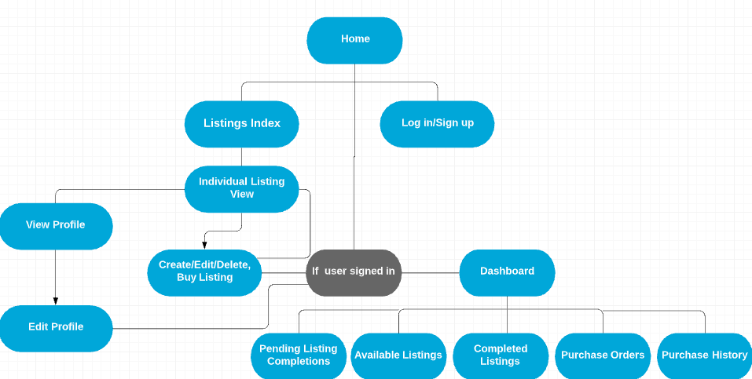

### Screenshots

**Homepage**

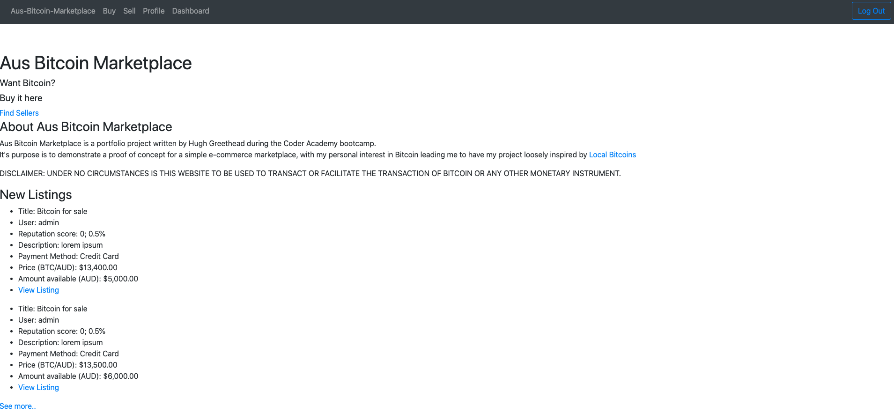

**Listings Index**

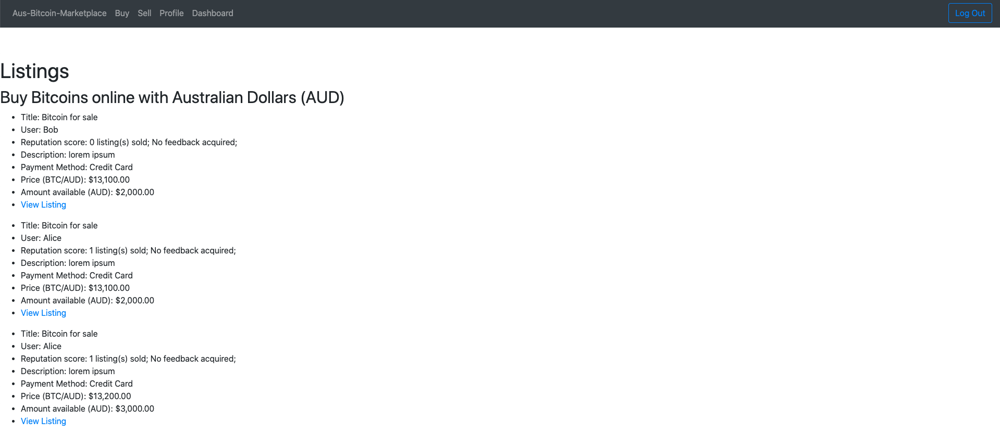

**Listing Show**

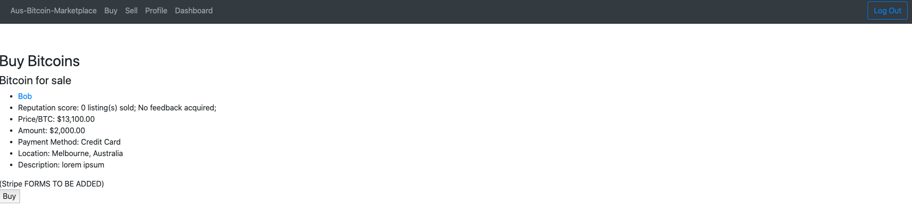

**Listing Create**

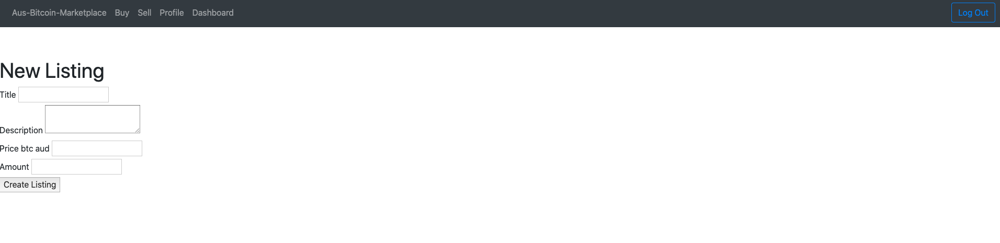

**Profile Show**

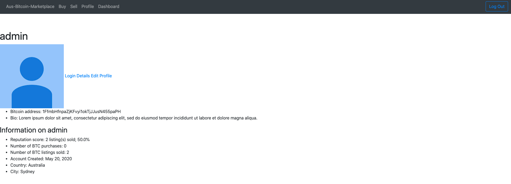

**Profile Edit**

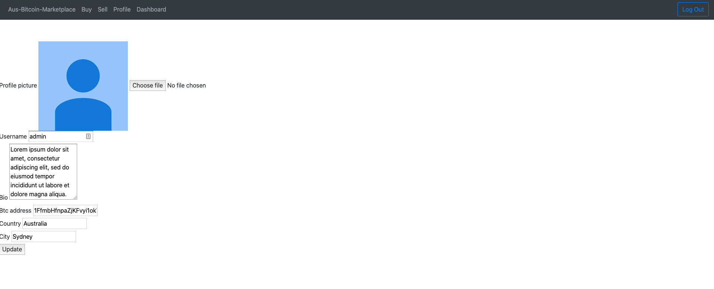

**Dashboard - Pending Listing Completions**

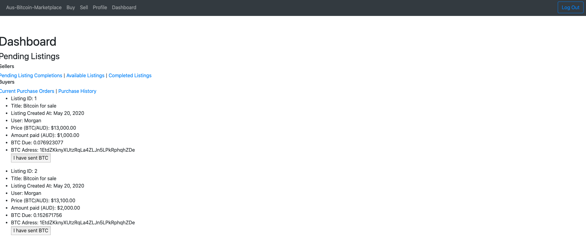

**Dashboard - Available Listings**

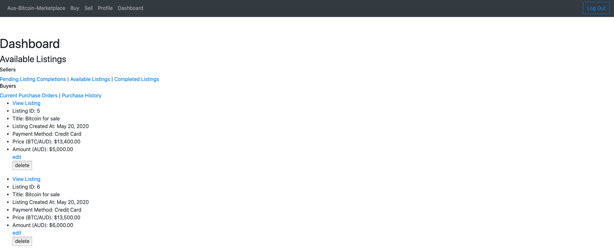

**Dashboard - Completed Listings**

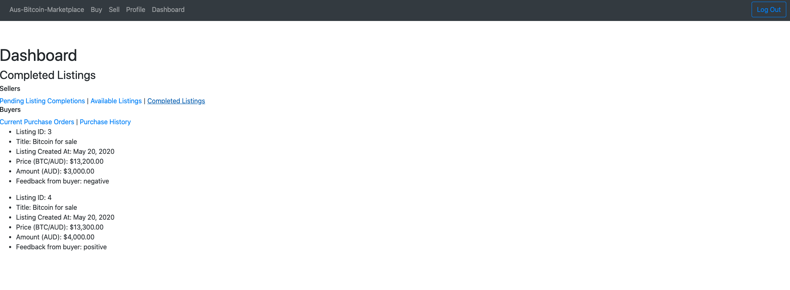

**Dashboard - Current Purchase Orders**

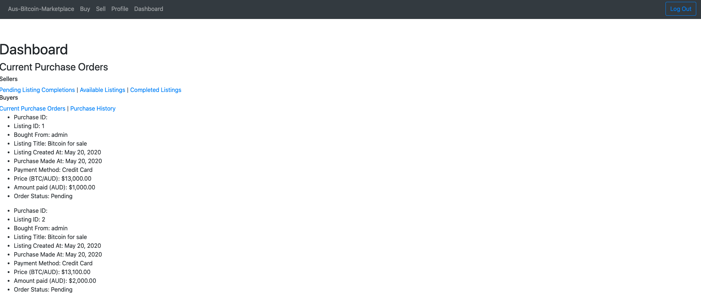

**Dashboard - Purchase History**

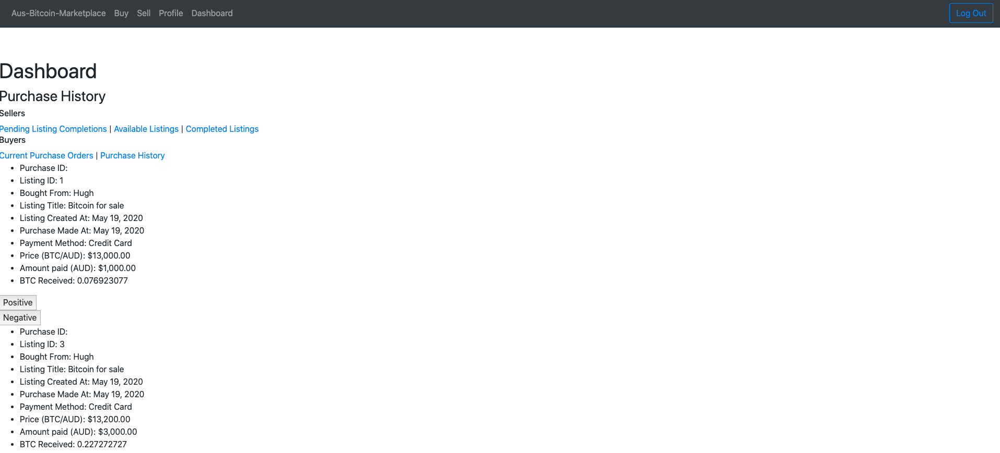

### Tech Stack

Front-end: HTML5, SCSS, Embedded Ruby, Bootstrap

Back-end: Ruby 2.7.0, Ruby on Rails 5.2.4.2

Database: Postgresql

Deployment: Heroku

Design/Project Management Tools: Balsamiq, Trello, Slack

Utilities: Devise, AWS S3

DevOps: Git, Github, VS Code, Bundler

The major 3rd party services used for the Aus-Bitcoin-Marketplace:

Amazon S3 - (Simple Storage Service), is a service that is used to provide object storage through a web service interface. It allows for files, in this app's case pictures, to be uploaded and stored in a high scalable and inexpensive way (free for low usage). User uploads are stored in S3 buckets, which is similar to a file folder, made specifically for a production application.

Heroku, is a cloud platform as a service which supports the production deployment of Ruby on Rails apps (as well as others like Python, Node.js etc). Heroku allows users to run their applications in virtual containers which execute on a reliable runtime and scale with demand. Heroku also supports PostgreSQL as a service, allowing for Postgres features for a deployed application.

Devise, is a ruby gem installed to handle authentication. It allows users to create account with an email address and password that is used to authenticate with Devise. It provides some helper methods, such as current_user, which assist in creating the correct authorisations within an application as per your design.

## User Stories

This application assumes that all of the users are in Australia, this is to simplify the scope of the application.

### MVP level requirements user stories

**User Management/Profiles**

Management:
- As a site visitor, I want to be able to create an account in order to log in and become a buyer and seller.
- As a buyer or seller, I want to be able to enter my email and password to log in.
- As a buyer or seller, I want to be able to logout out of my account at any time.
- As a buyer or seller, I want to be able to delete my account if I no longer want to be a part of the site.
- As a buyer or seller, I want to be able to delete my account in case I change my mind.

Profiles:
- A registered user needs to have a profile picture
- As a buyer or seller, I want to be able to add details to my profile in order to show other users more about me - in order to build trust in people to transact with me
- As a user (buyers will have this), I want to have a Bitcoin address associated with my profile - in order to be used for receiving Bitcoin payments to

**Listings:**

- As a seller, I want to be able to create listings in order to sell my Bitcoin - **only** sellers can create listings

Viewing overview of listings:
- As a site visitor, I want to be able to see an overview of listings without logging in.
- As a buyer, I want to be able see the users name, their payment method(s), price, amount, number of trades they've done and their reputation score + a buy button that takes them to the individual listing page

Listings (view listing) detail page:
- As a buyer, I want to be able to see the users name, their payment method(s), price, the amount, number of trades they've done and their reputation score
- As a buyer, I'd like to enter how much I want to buy (in terms of AUD), and the application calculates and tells me how many BTC that is based on the listing price
- As a buyer, I want to be able to enter the payment details/make the payment for the listing (e.g. make manual deposit according to listing, stripe payment, Paypal payment etc) 
- As a buyer, I would like confirmation that my order/payment has gone through/been accepted 

Creating/editing a listing:
- As Seller creating a listing, I need to be able to specify(upload) a country and a city for the location, the payment method, the Bank name, the price, the amount and the terms of trade
- As a seller creating a listing, I would also like the option of specifying additional payment details (e.g. instructions of how to wire money), minimum feedback score (specify minimum reputation needed to transact)
- As a seller, I want to be able to edit my listings in order to reflect correct information.

Delete:
- As a seller, I want to be able to delete my listings

**Dashboard**

Sellers:
- As a seller, I want to be able to view my current listings in one place in order to keep track of what I am selling.
- As a seller, I want a place to view the orders that have been made, that include the details of how much was sent and provides their address to send the Bitcoin to
- As a seller, I want to be able to mark once the transaction is complete, once I've sent the Bitcoin to the buyer (i.e. order filled) 
- As a seller, I want to be able to view a list of my completed transactions
- On the completed transactions list, I'd like to be able to give a feedback rating to the buyer for that transaction, i.e. one rating per transaction (that goes towards their reputation score) 

Buyers:
- As a buyer, I want to be able to view a list of my pendinng/open orders - i.e. where I have paid for Bitcoin, but order is not yet marked as complete by the seller yet
- As a buyer, I want to be able to view a list of my completed transactions
- On the completed transactions list, I'd like to be able to give a feedback rating to the seller for that transaction, i.e. one rating per transaction (that goes towards their reputation score) 


**Authentication & Authorisation:**
- As a buyer or seller, I do not want other users to be able to access my account in order to keep my data safe.
- As a seller, I do not want other users to be able to edit or delete my listings.
- As a seller, I do not want to see options to buy my own listings.

### Additional stretch requirement user stories (attempted after MVP is functional)

**Stretch 1** 

Listings:
- As a buyer, I want to be able to see the current CoinMarketCap price for Bitcoin to compare to the prices listed
- As a buyer, I want to be able to search/filter listings according to how much I want to buy (in dollar terms), and by the payment type

**Stretch 2**

Listings:
- As a seller, I want to be able to set what margin (how much my price differs) I want to have above the market (Coinmarketcap) price and the application will adjust my seller listing price accordingly to maintain the same level of margin as the API price updates (API call made every 10mins/hour or something like that)
- As a buyer, I want to be able to specify the fiat currency I wish to transact in (as opposed to just AUD only) 
- As a seller, I want to be able to specify the fiat currency I wish to transact in (as opposed to just AUD only)
*Start with USD support (users could accept USD, or USD stable coins - Tether, USDC) then expand to other currencies when it makes sense to do so.

**Stretch 3**

Dashboard:
- As a seller, I want to be able to reply to buyers messages in order to answer questions about my listings.
- As a buyer, I want to be able to message sellers about listings in order to find out more information.
- As a buyer or seller, I want to be notified when I receive a new message so I don't have to keep checking my inbox.
- As a buyer or seller, I want to be able to send messages to another user about their listing within an internal messaging system within the app 


## Wireframes

**Homepage**
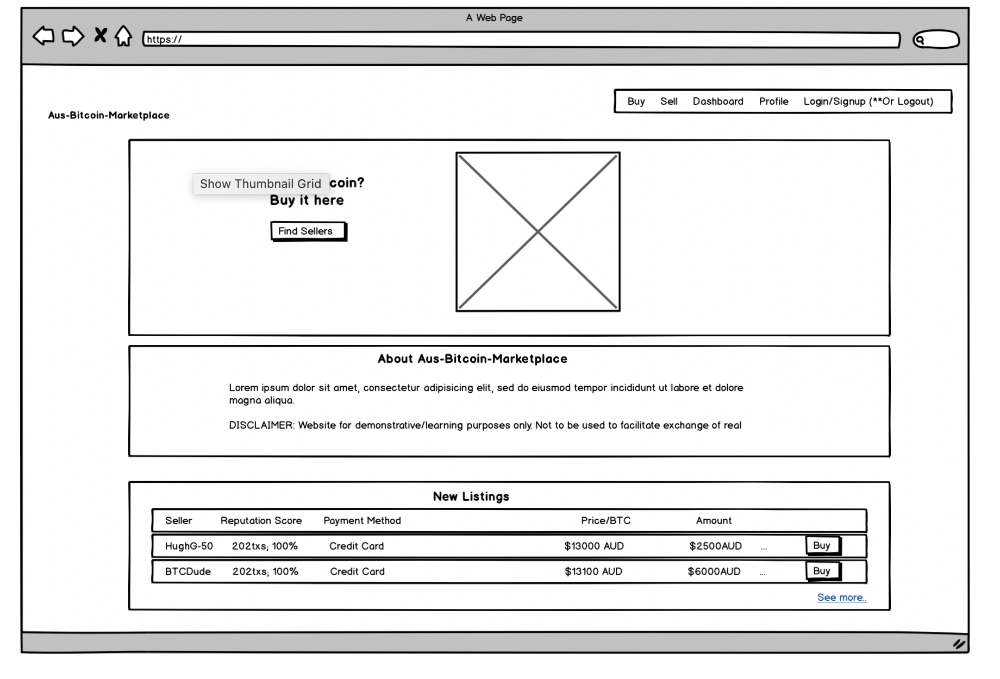
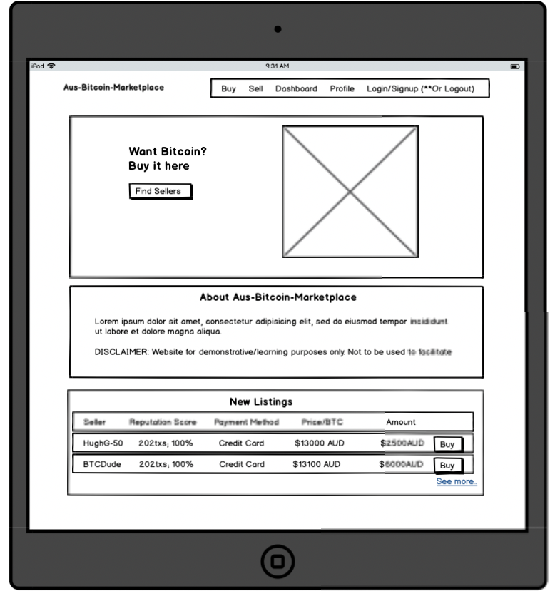
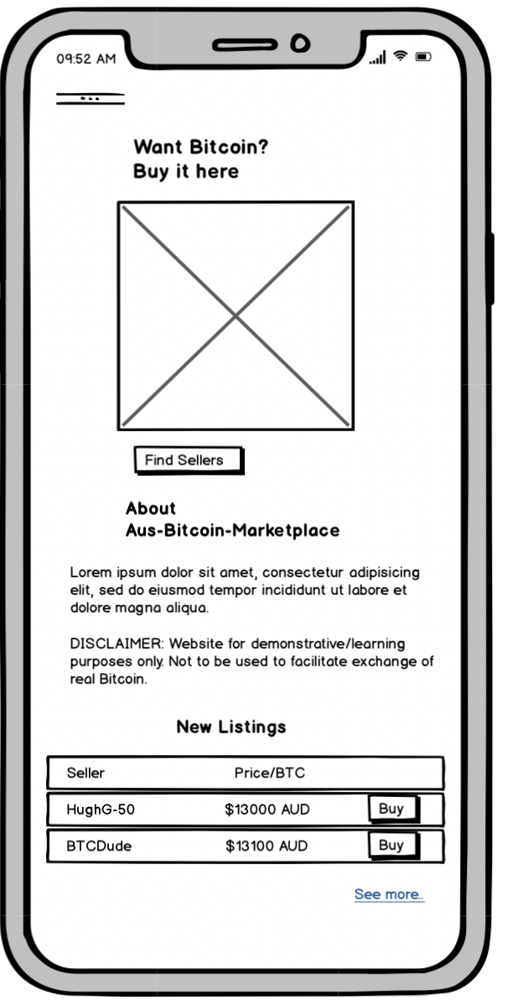

**Listings**
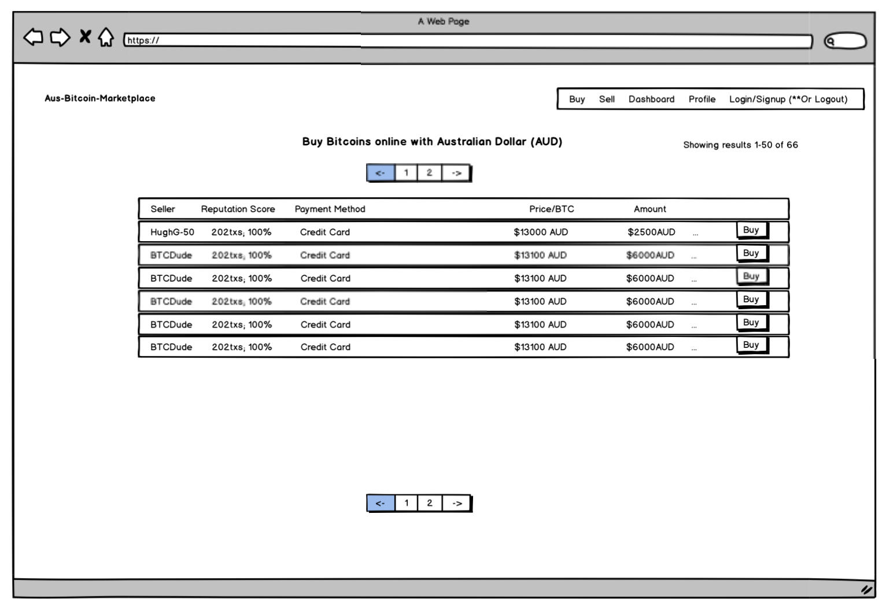
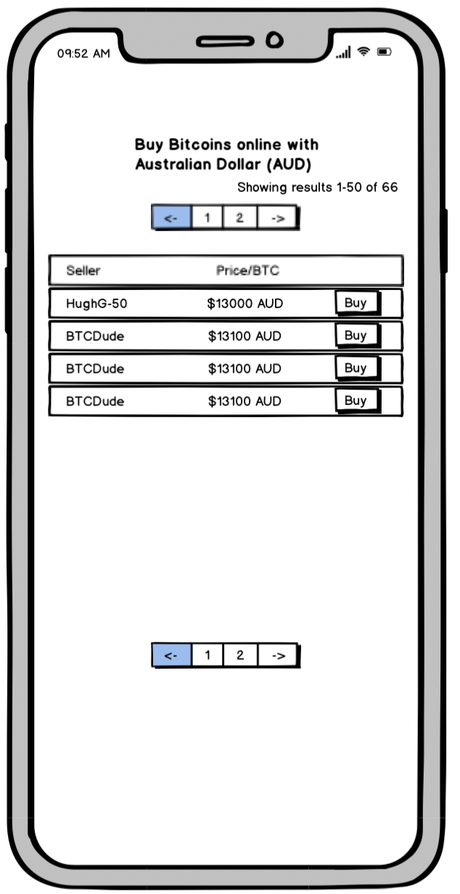

**Listing View**
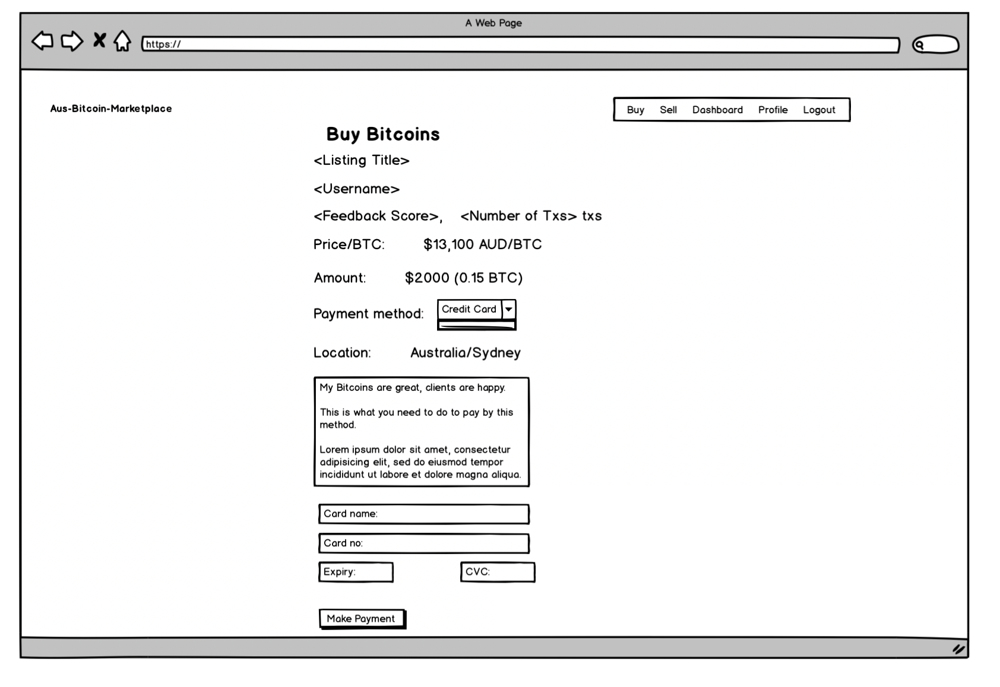
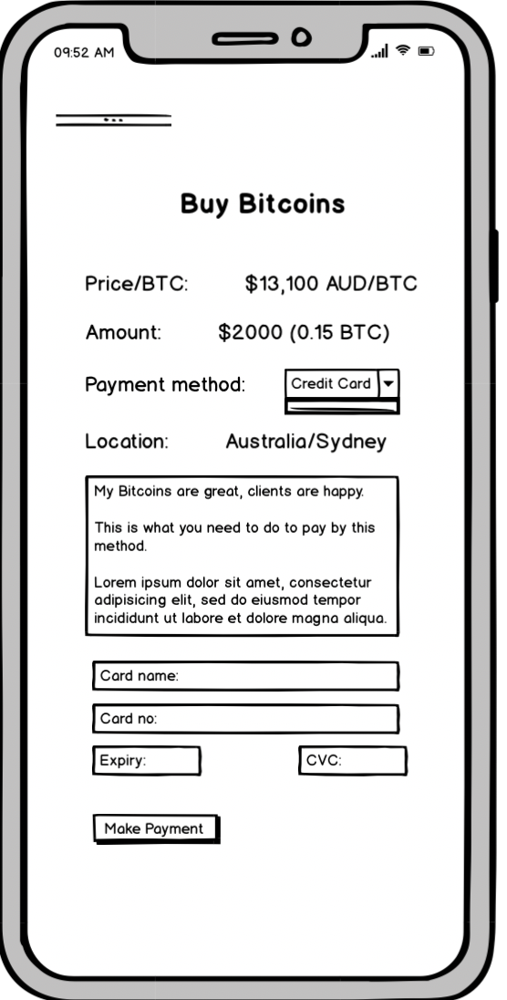

**Profile**
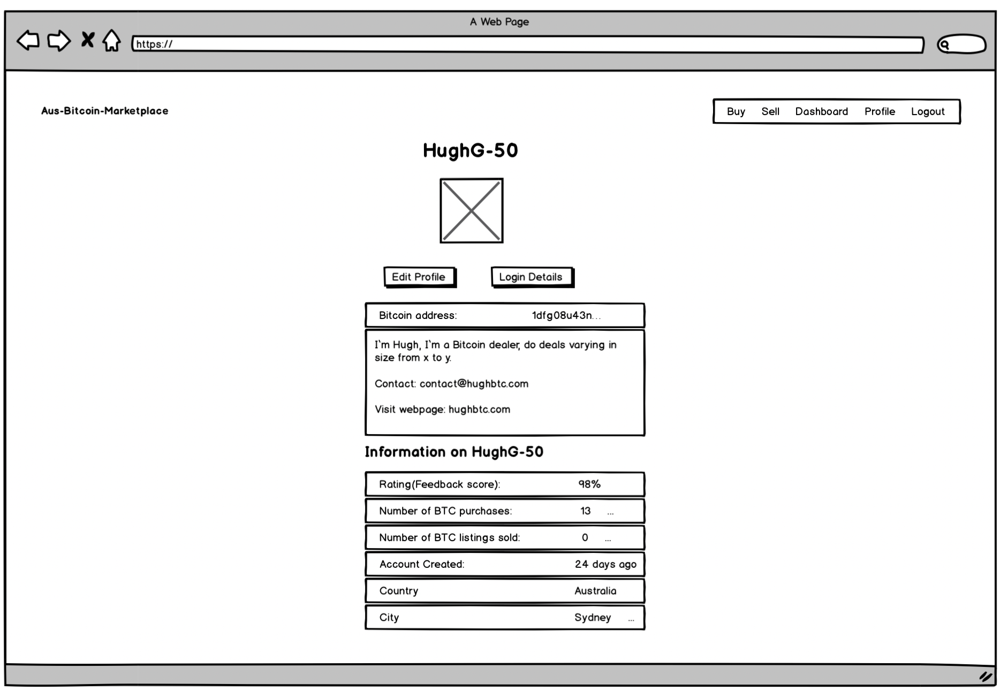

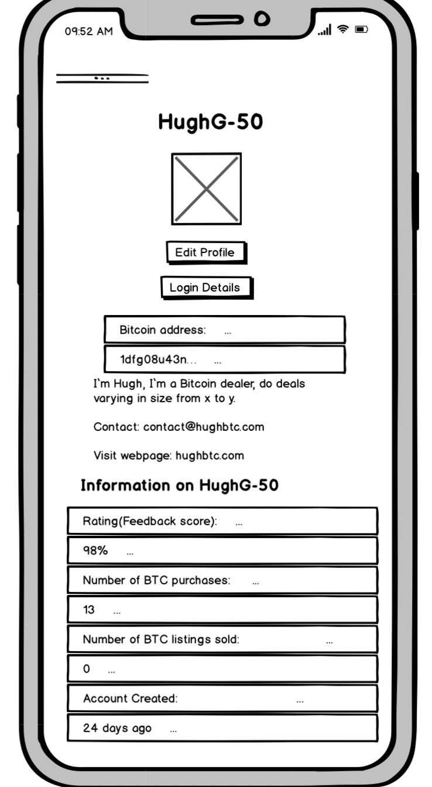

**Dashboard**
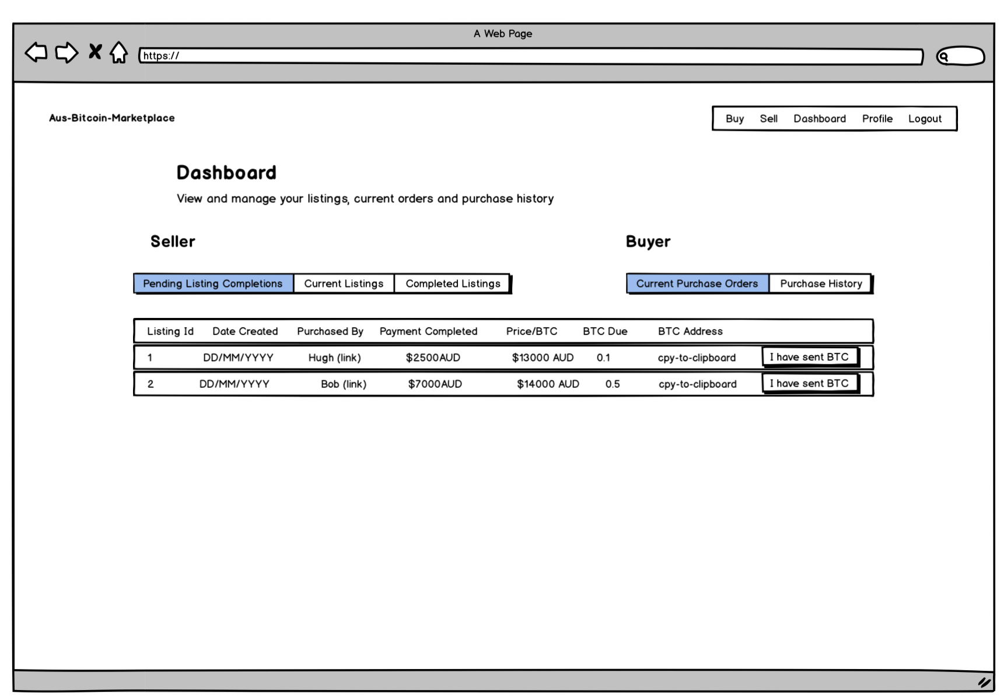
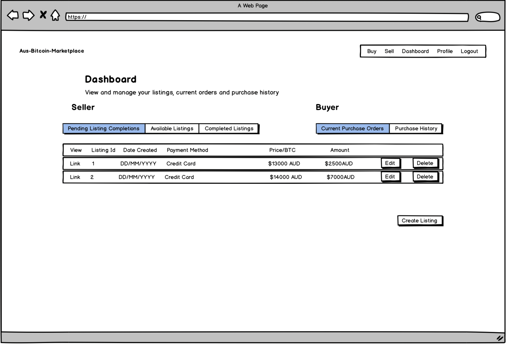
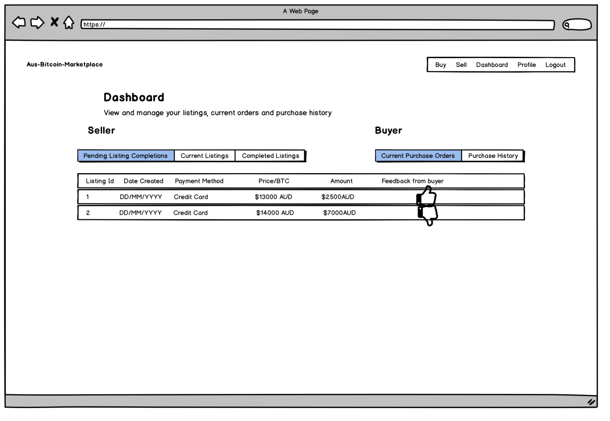
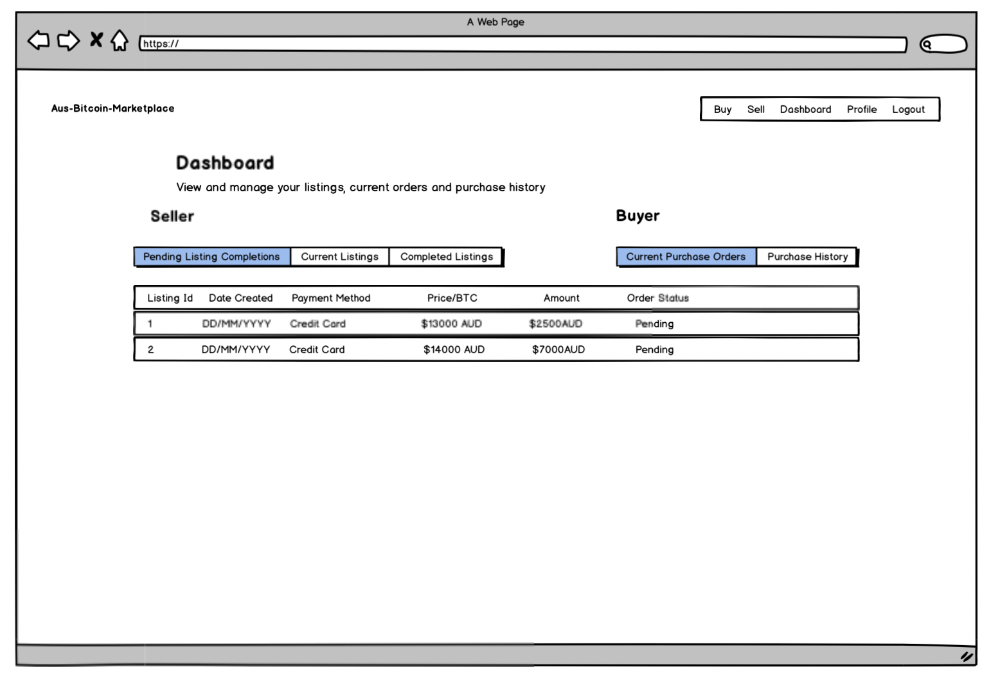
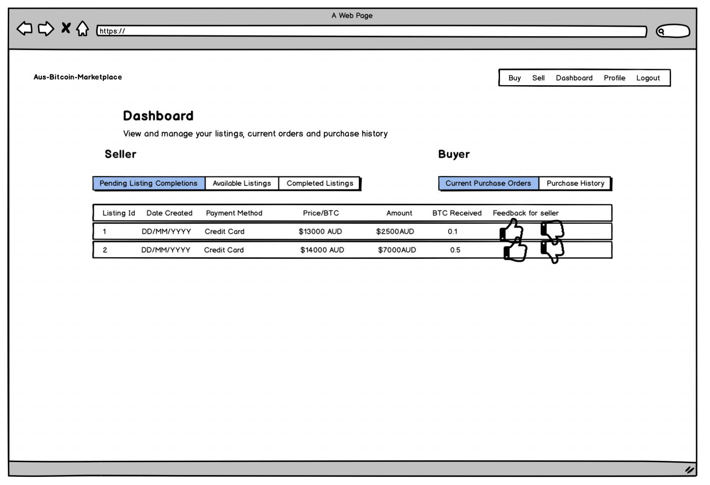

## Model Relationships

A user ```has_many``` listings, a listing ```belongs_to``` a user

A user ```has_many``` purchases, a purchase ```belongs_to``` a user

A user ```has_one_attached``` picture, a picture ```belongs_to``` a user

A listing ```has_one``` purchase, a purchase ```belongs_to``` a listing

The associations created end up being circular because a user can be both a buyer and a seller. That is, users can create listings, which can then be purchased by another user, while they themselves as a user can also purchase other listings. 

## Database relationships and schema

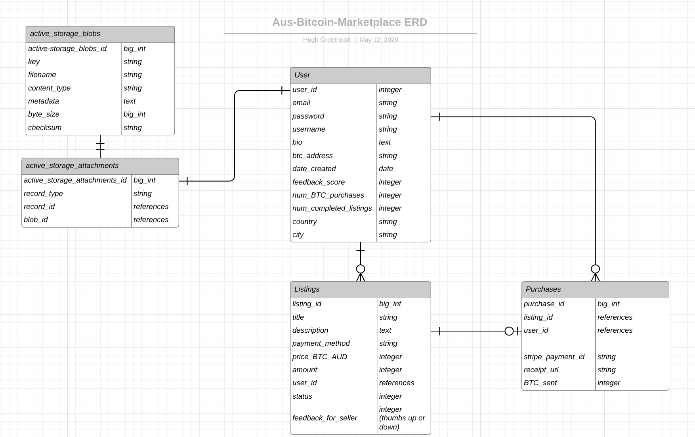

### Discuss the database relations to be implemented

The database relations are created through the use of foreign keys. The foreign keys create *belongs_to* relations which link the related tables together by adding a column to a table with each row referencing an id of an object in the table it is related to.

**Users**

Active storage attachments, listings and purchases all belong to a user, (and only have one user) as indicated by the single dash on the ERD. This is to define the functionality in the web app that the user controls all of the primary actions within the website. 

That is a user can act as a buyer and own/make purchases, control their profile to upload profile pictures and act as a seller to create listings to sell Bitcoin.

**Listings**

A listing belongs to a user with the table containing a foreign key of user_id, to link a listing with a user. A user can have zero or many listings - that is, a user of the web app could decide to create as many listings to sell Bitcoin as they would like or none at all.

A listing has a purchase that *belongs_to* it. That is, a listing can only have one purchase (or in terms of a user of the app, each listing can only be purchased once).

**Purchases**

A purchase belongs to a user and a listing - in the ERD the Purchase table has both a listing_id and user_id foreign key. 

A user can have many purchases, while a listing can have only one purchase. That is, a buyer can make zero or as many purchases as they would like, while a listing made by another user can only be purchased once.

The existence of a purchase object related to a listing object is used to indicate that a purchase has been made, and status fields in the listing table are then updated as a result.

**Active Record**

The active record storage tables are used to allow images to be uploaded and stored. Each user has one active storage table associated with it (they belong to the user), which allows the user to have dynamic image storage in a scalable manner, as they are connected with Amazon S3 cloud storage.

### Schema Design

Every table in the database has an associated ID to identify it as well as the ```created_at: datetime``` and ```updated_at: datetime``` attributes.

**Users**

```
email:string
password:string
username:string
bio:text
btc_address:string
feedback_score:float
num_BTC_purchases:integer
num_completed_listings:integer
country:string
city:string
```

**Listings**

```
user_id:references
title:string
description:text
payment_method:string
price_BTC_AUD:integer
amount:integer
status:integer
feedback_for_seller:integer
```
```status``` and ```feedback_for_seller``` are enumerated types, to represent different states of the object. Status has three states, *Available listing*, *Pending listing completion* and *completed listing*. These are necessary to dictate filtering of displays such that the correct data is presented in different views - e.g. in the dashboard. 

```feedback_for_seller``` can be *postive* or *negative*, however by having the attribute be an integer in the database, it leaves flexibility for a more complex implementation such as a 0-100 scale to be introduced with minimal migrations needed to change the database.

**Purchases**

```
user_id:references
listing_id:references
stripe_payment_id:string
receipt_url:string
btc_sent:integer
```
The attributes ```stripe_payment_id``` and ```receipt_url``` were intended to be used with the Stripe API, however the initial MVP version of the app did not integrate the API due to running out of time. ```btc_sent``` is an enum that maps whether the Bitcoin to complete a transaction was *sent* or *not_sent* to complete the transaction/listing.

**Active_Storage_Attachments**

```
name:string
record_type:string
record_id:references
blob_id:references
```

**Active_Storage_Blobs**

```
key:string
filename:string
content_type:string
metadata:text
byte_size:big_int
checksum:string
```

Both the Active Storage Attachments and Blobs schema are automatically generated installing the aws-sdk-s3 gem into the rails application. 

## Project Management/Tracking

### Describe the way tasks are planned and tracked in your project.

**Project Start**

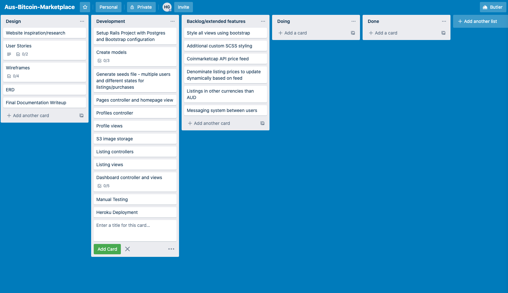 

**Project End**

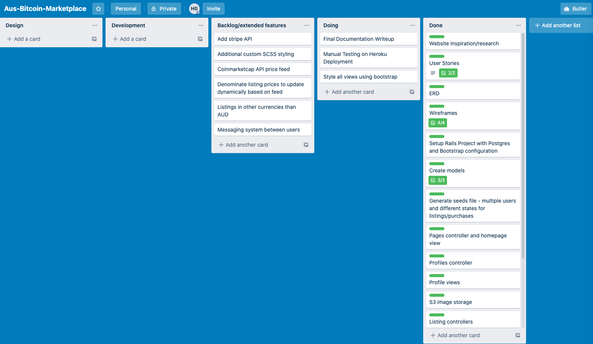 

Shows significant planning for how tasks are planned and tracked, including a full description of the process and of the tools used

The process used throughout the project was an agile methodology. The goal of this project, which in effect was a two-week 'sprint', was to produce an MVP marketplace application based on the initial design. 

The criteria for the MVP was that it was to have a working rails application that included User authentication and authorisation with Devise, CRUD functionality and active storage for images using S3. Anything else, including front-end styling/design is designated as low priority - i.e. not to be started until all other items are done first.

Also logical components of the application were grouped together in their development, e.g. building out the views as each controller was built out. This allows for easier visualisation of progress and quicker iterative feedback loops for manual testing and debugging.

## ERD - Normalised database model


## Additional notes on design choices and app limitations

It is important to note that this application is purely for demonstrative purposes on how a marketplace might function. Under no circumstances should it be used to facilitate real transactions. 

The exchange of Bitcoin and cryptocurrencies is subject to many strict regulations, most notably the requirement for Know Your Customer/Anti-Money Laundering practices. This typically involves collecting and storing documents identifying and verifying users, attached to their user ID, with verification typically being conducted by a certified KYC provider. Such a process has many legal considerations and is costly, and as such is beyond the scope for this project - i.e. while theoretically this application could work, legally it cannot.

Also to build further trust and facilitate safer exchange of Bitcoin, most Bitcoin Exchange Marketplaces, including Local Bitcoins upon which this application is inspired by, take custody of the Bitcoins being exchanged and hold them in escrow. This allows for easier dispute resolution, provides greater confidence for buyers and sellers and significantly reduces the chances of fraudulent transactions occuring. 

BTC addresses have to be associated with profiles. That way, at least a user would be able to view the address and look for transactions consistent with what seller may be advertising to build trust. Also a system could later be put in where a small tx is sent to the wallet and the funds must be sent back in order to verify ownership of wallet to allow for use on the site. (There are better alternative verification methods available, but at least this allows for this possibility).


